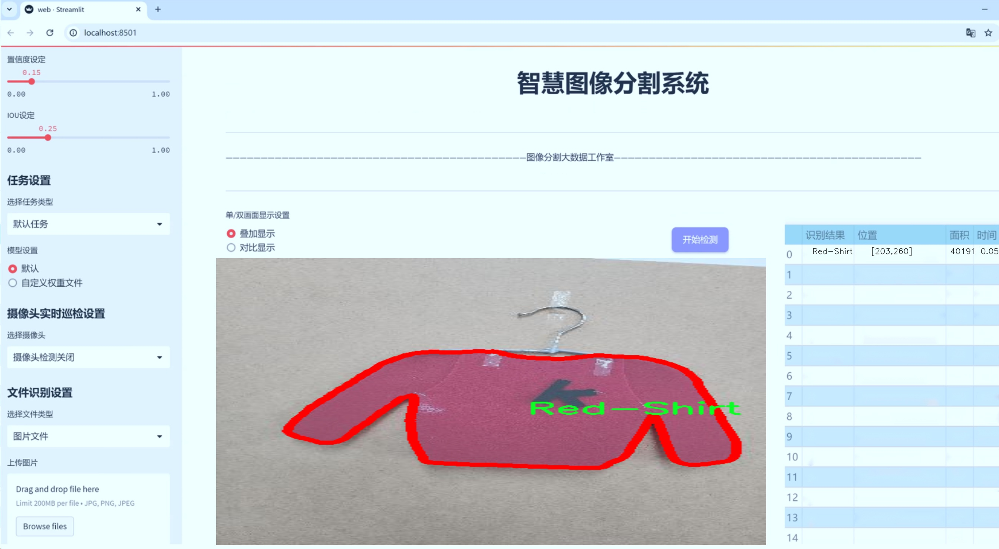
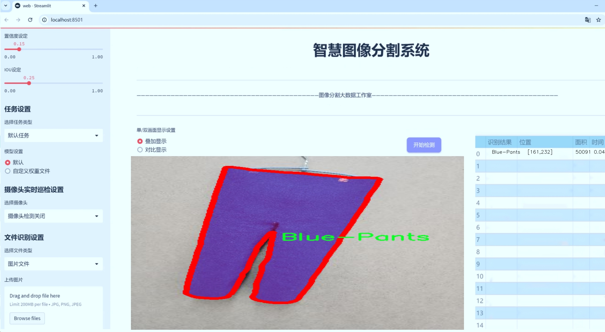
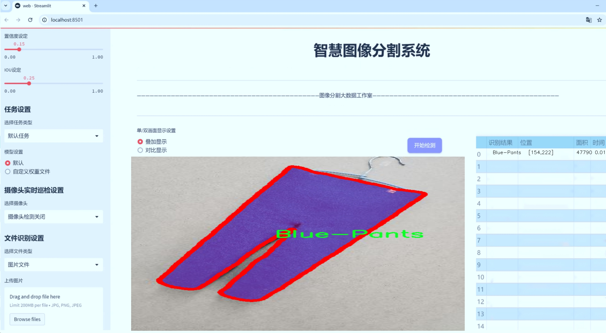
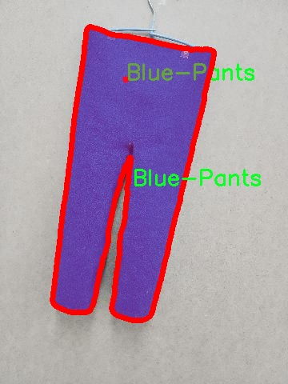
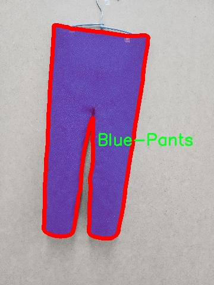
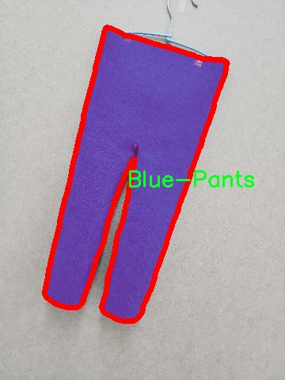
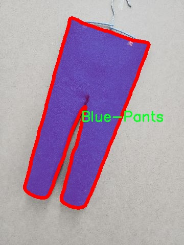
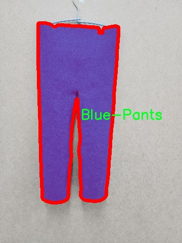

# 服装图像分割系统： yolov8-seg-C2f-ContextGuided

### 1.研究背景与意义

[参考博客](https://gitee.com/YOLOv8_YOLOv11_Segmentation_Studio/projects)

[博客来源](https://kdocs.cn/l/cszuIiCKVNis)

研究背景与意义

随着计算机视觉技术的迅猛发展，服装图像处理在时尚产业、电子商务以及个性化推荐系统中扮演着越来越重要的角色。尤其是在服装图像分割领域，精确地识别和分离服装元素不仅能够提升用户体验，还能为后续的图像分析和处理提供可靠的基础。近年来，YOLO（You Only Look Once）系列模型因其高效的实时检测能力而受到广泛关注。YOLOv8作为该系列的最新版本，进一步提升了目标检测的精度和速度，成为服装图像分割任务的理想选择。

本研究旨在基于改进的YOLOv8模型，构建一个高效的服装图像分割系统，以实现对多种服装类别的准确识别与分割。所使用的数据集“dressme_Final”包含1400张图像，涵盖了10个不同的服装类别，包括黑色裙子、黑色T恤、蓝色裤子、灰色裤子、衣架、粉色短裤、粉色T恤、红色衬衫、红色短裤和白色衬衫。这些类别的多样性为模型的训练和测试提供了丰富的样本，能够有效提高模型的泛化能力和实用性。

在当前的服装图像处理研究中，存在着诸多挑战，例如不同光照条件、复杂背景、服装的遮挡以及多样的服装款式等。这些因素使得传统的图像分割方法难以实现高精度的分割效果。因此，利用深度学习技术，尤其是YOLOv8的实例分割能力，将为解决这些问题提供新的思路。通过对YOLOv8模型的改进，结合适当的数据增强和迁移学习策略，能够显著提升模型在复杂场景下的表现。

本研究的意义不仅在于提升服装图像分割的精度和效率，更在于推动智能时尚领域的发展。随着个性化消费需求的增加，服装图像分割技术的应用前景广阔。例如，在电子商务平台中，精准的服装分割能够为用户提供更为直观的产品展示，提升购买决策的效率。此外，服装图像分割技术还可以为虚拟试衣间、智能搭配推荐等应用提供技术支持，进一步提升用户的购物体验。

综上所述，基于改进YOLOv8的服装图像分割系统的研究不仅具有重要的学术价值，也具有广泛的应用前景。通过深入探讨和实现这一系统，将为服装图像处理领域提供新的解决方案，并为相关产业的数字化转型贡献力量。希望本研究能够为未来的相关研究提供参考，并推动服装图像分割技术的进一步发展。

### 2.图片演示







注意：本项目提供完整的训练源码数据集和训练教程,由于此博客编辑较早,暂不提供权重文件（best.pt）,需要按照6.训练教程进行训练后实现上图效果。

### 3.视频演示

[3.1 视频演示](https://www.bilibili.com/video/BV11UBxYSEM2/)

### 4.数据集信息

##### 4.1 数据集类别数＆类别名

nc: 10
names: ['Black-Skirt', 'Black-Tshirts', 'Blue-Pants', 'Grey-Pants', 'Hanger', 'Pink-Shorts', 'Pink-Tshirts', 'Red-Shirt', 'Red-Shorts', 'White-Shirt']


##### 4.2 数据集信息简介

数据集信息展示

在本研究中，我们采用了名为“dressme_Final”的数据集，以训练和改进YOLOv8-seg模型在服装图像分割任务中的表现。该数据集专门针对服装类物品的图像进行标注，涵盖了多种服装类型，旨在提升计算机视觉系统在服装识别和分割方面的准确性和效率。数据集的类别数量为10，具体类别包括：黑色裙子（Black-Skirt）、黑色T恤（Black-Tshirts）、蓝色裤子（Blue-Pants）、灰色裤子（Grey-Pants）、衣架（Hanger）、粉色短裤（Pink-Shorts）、粉色T恤（Pink-Tshirts）、红色衬衫（Red-Shirt）、红色短裤（Red-Shorts）以及白色衬衫（White-Shirt）。这些类别的选择不仅反映了当前时尚趋势，也为模型的多样性和适应性提供了丰富的训练样本。

“dressme_Final”数据集中的图像均经过精心挑选和标注，确保每个类别的样本数量充足且具有代表性。数据集中包含的图像涵盖了不同的拍摄角度、光照条件和背景环境，使得模型在训练过程中能够学习到更加全面的特征。这种多样性不仅有助于提高模型的鲁棒性，还能有效减少过拟合的风险。通过对这些图像进行分割标注，数据集为YOLOv8-seg模型提供了明确的学习目标，使其能够在复杂的服装图像中准确识别和分割出不同的服装类别。

在训练过程中，我们将利用数据集中的图像进行增强处理，包括旋转、缩放、翻转等操作，以进一步丰富训练样本的多样性。这些数据增强技术将帮助模型更好地适应不同的场景和条件，从而提高其在实际应用中的表现。此外，数据集中的每个类别均有相应的标注信息，确保模型在训练时能够准确理解每个服装类别的特征和边界。这种精细的标注不仅提高了模型的学习效率，也为后续的评估和测试提供了可靠的依据。

通过对“dressme_Final”数据集的深入分析和应用，我们期望能够显著提升YOLOv8-seg模型在服装图像分割任务中的性能。该数据集的设计理念与实际应用场景紧密结合，旨在为服装行业的智能化发展提供技术支持。未来，我们将继续探索更多的数据集和模型改进策略，以推动服装图像分割技术的进步，助力时尚行业的数字化转型。

总之，“dressme_Final”数据集为本研究提供了坚实的基础，凭借其丰富的类别和高质量的标注信息，必将为YOLOv8-seg模型的训练和应用带来积极的影响。通过不断优化和改进，我们希望能够在服装图像分割领域取得突破性进展，为相关行业提供更为精准和高效的解决方案。











### 5.项目依赖环境部署教程（零基础手把手教学）

[5.1 环境部署教程链接（零基础手把手教学）](https://www.bilibili.com/video/BV1jG4Ve4E9t/?vd_source=bc9aec86d164b67a7004b996143742dc)


[5.2 安装Python虚拟环境创建和依赖库安装视频教程链接（零基础手把手教学）](https://www.bilibili.com/video/BV1nA4VeYEze/?vd_source=bc9aec86d164b67a7004b996143742dc)

### 6.手把手YOLOV8-seg训练视频教程（零基础手把手教学）

[6.1 手把手YOLOV8-seg训练视频教程（零基础小白有手就能学会）](https://www.bilibili.com/video/BV1cA4VeYETe/?vd_source=bc9aec86d164b67a7004b996143742dc)


按照上面的训练视频教程链接加载项目提供的数据集，运行train.py即可开始训练



     Epoch   gpu_mem       box       obj       cls    labels  img_size
     1/200     0G   0.01576   0.01955  0.007536        22      1280: 100%|██████████| 849/849 [14:42<00:00,  1.04s/it]
               Class     Images     Labels          P          R     mAP@.5 mAP@.5:.95: 100%|██████████| 213/213 [01:14<00:00,  2.87it/s]
                 all       3395      17314      0.994      0.957      0.0957      0.0843

     Epoch   gpu_mem       box       obj       cls    labels  img_size
     2/200     0G   0.01578   0.01923  0.007006        22      1280: 100%|██████████| 849/849 [14:44<00:00,  1.04s/it]
               Class     Images     Labels          P          R     mAP@.5 mAP@.5:.95: 100%|██████████| 213/213 [01:12<00:00,  2.95it/s]
                 all       3395      17314      0.996      0.956      0.0957      0.0845

     Epoch   gpu_mem       box       obj       cls    labels  img_size
     3/200     0G   0.01561    0.0191  0.006895        27      1280: 100%|██████████| 849/849 [10:56<00:00,  1.29it/s]
               Class     Images     Labels          P          R     mAP@.5 mAP@.5:.95: 100%|███████   | 187/213 [00:52<00:00,  4.04it/s]
                 all       3395      17314      0.996      0.957      0.0957      0.0845


### 7.50+种全套YOLOV8-seg创新点加载调参实验视频教程（一键加载写好的改进模型的配置文件）

[7.1 50+种全套YOLOV8-seg创新点加载调参实验视频教程（一键加载写好的改进模型的配置文件）](https://www.bilibili.com/video/BV1Hw4VePEXv/?vd_source=bc9aec86d164b67a7004b996143742dc)

### YOLOV8-seg算法简介

原始YOLOV8-seg算法原理

YOLOV8-seg作为YOLO系列中的最新一员，继承并发展了前几代模型的核心思想，尤其是在目标检测和图像分割任务中的应用。与传统的基于锚框的检测方法相比，YOLOV8-seg采用了无锚框（anchor-free）策略，这一创新使得模型在处理复杂场景时表现出更高的检测精度和速度。这种设计理念的核心在于，YOLOV8-seg能够直接预测目标的中心点及其宽高比，从而减少了对锚框的依赖，降低了模型的复杂性。

YOLOV8-seg的网络结构主要由四个模块组成：输入端、主干网络、Neck端和输出端。输入端负责对输入图像进行预处理，包括Mosaic数据增强、自适应图片缩放和灰度填充等。这些步骤不仅增强了模型的鲁棒性，还提高了其在不同场景下的适应能力。主干网络则采用了CSPDarknet结构，结合了卷积和池化操作，旨在提取图像中的特征信息。特别地，YOLOV8-seg引入了C2f模块，通过将输入特征图分为多个分支并进行融合，提升了特征提取的效率和准确性。

在Neck端，YOLOV8-seg利用了路径聚合网络（PAN）结构，通过上采样和下采样操作实现了不同尺度特征图的融合。这一过程对于多尺度目标的检测至关重要，因为在复杂的环境中，目标的大小和形状可能会有很大的变化。输出端则采用了解耦头（decoupled head）结构，将分类和回归过程分开处理，从而提高了模型的训练效率和检测精度。具体而言，YOLOV8-seg在损失计算方面使用了BCE（binary cross-entropy）计算分类损失，并结合DFL（distribution focal loss）和CIoU（complete intersection over union）损失函数来优化回归损失。

尽管YOLOV8-seg在多个方面进行了优化，但在复杂水面环境下的应用仍然面临挑战。小目标漂浮物的特征复杂且背景多样，导致了定位误差和目标感知能力不足的问题。为了解决这些问题，YOLOV8-seg引入了YOLOV8-WSSOD算法进行改进。首先，针对主干网络下采样过程中的噪声影响，YOLOV8-WSSOD引入了BiFormer双层路由注意力机制，构建了C2fBF模块。这一模块能够捕获远程依赖关系，从而保留特征提取过程中更细粒度的上下文信息，增强了模型对小目标的感知能力。

其次，为了应对小目标漏检的问题，YOLOV8-WSSOD在网络中添加了一个更小的检测头。这一设计使得模型能够更有效地识别小目标，提升了其在复杂环境中的表现。此外，在Neck端引入了GSConv和Slim-neck技术，旨在保持检测精度的同时降低计算量。这一平衡使得YOLOV8-WSSOD在资源受限的情况下仍能保持良好的性能。

最后，YOLOV8-WSSOD使用了MPDIoU损失函数替换了CIoU损失函数，以提高模型的泛化能力和精准度。MPDIoU损失函数通过考虑目标的多维信息，进一步优化了模型在复杂场景下的表现。这一系列的改进使得YOLOV8-seg在小目标检测和复杂背景处理方面具备了更强的能力。

综上所述，YOLOV8-seg算法通过无锚框的检测方式、先进的特征提取模块以及优化的损失函数，展现了其在目标检测和图像分割任务中的潜力。尽管在特定环境下仍存在挑战，但通过不断的改进和优化，YOLOV8-seg有望在更广泛的应用场景中发挥其优势，推动目标检测技术的发展。


### 9.系统功能展示（检测对象为举例，实际内容以本项目数据集为准）

图9.1.系统支持检测结果表格显示

  图9.2.系统支持置信度和IOU阈值手动调节

  图9.3.系统支持自定义加载权重文件best.pt(需要你通过步骤5中训练获得)

  图9.4.系统支持摄像头实时识别

  图9.5.系统支持图片识别

  图9.6.系统支持视频识别

  图9.7.系统支持识别结果文件自动保存

  图9.8.系统支持Excel导出检测结果数据


### 10.50+种全套YOLOV8-seg创新点原理讲解（非科班也可以轻松写刊发刊，V11版本正在科研待更新）

#### 10.1 由于篇幅限制，每个创新点的具体原理讲解就不一一展开，具体见下列网址中的创新点对应子项目的技术原理博客网址【Blog】：


[10.1 50+种全套YOLOV8-seg创新点原理讲解链接](https://gitee.com/qunmasj/good)

#### 10.2 部分改进模块原理讲解(完整的改进原理见上图和技术博客链接)【如果此小节的图加载失败可以通过CSDN或者Github搜索该博客的标题访问原始博客，原始博客图片显示正常】
### YOLOv8简介

YOLOv8 是 Ultralytics 公司继 YOLOv5 算法之后开发的下一代算法模型，目前支持图像分类、物体检测和实例分割任务。YOLOv8 是一个 SOTA 模型，它建立在之前YOLO 系列模型的成功基础上，并引入了新的功能和改进，以进一步提升性能和灵活性。具体创新包括：一个新的骨干网络、一个新的 Ancher-Free 检测头和一个新的损失函数，可以在从 CPU 到 GPU 的各种硬件平台上运行。注意到ultralytics 并没有直接将开源库命名为 YOLOv8，而是直接使用 Ultralytics这个单词，原因是Ultralytics这个库的定位是算法框架，而非特指某一个特定算法，其希望这个库不仅仅能够用于 YOLO 系列模型，同时也能支持其他的视觉任务如图像分类、实例分割等。下图画图YOLOv8目标检测算法同其他YOLO系列算法（YOLOv5、6、7）的实验对比图，左边是模型参数量对比，右边是速度对比。


下面两个表分别是YOLOv8和YOLOv5（v7.0版本）官方在 COCO Val 2017 数据集上测试结果，从中看出 YOLOv8 相比 YOLOv5 精度提升大，但是 N/S/M 模型相应的参数量、FLOPS等提高了不少。


#### YOLOv8概述
提供了一个全新的SOTA模型，和YOLOv5一样，基于缩放系数也提供了 N/S/M/L/X 尺度的不同大小模型，用于满足不同场景需求，同时支持图像分类、目标检测、实例分割和姿态检测任务
在骨干网络和Neck部分将YOLOv5的C3结构换成了梯度流更丰富的 C2f 结构，并对不同尺度模型调整了不同的通道数，大幅提升了模型性能；需要注意的是C2f 模块中存在Split等操作对特定硬件部署没有之前那么友好


Head部分换成了目前主流的解耦头结构，将分类和检测头分离，同时也从 Anchor-Based换成了Anchor-Free Loss
计算方面采用了 TaskAlignedAssigner 正样本分配策略，并引入了 Distribution Focal Loss
下图画出YOLOv8目标检测算法的整体结构图


#### YOLOv8模型
YOLOv8目标检测算法的模型配置文件如下：


从配置文件可以看出，YOLOv8与YOLOv5模型最明显的差异是使用C2F模块替换了原来的C3模块，两个模块的结构图下图所示。


另外Head 部分变化最大，从原先的耦合头变成了解耦头，并且从 YOLOv5 的 Anchor-Based 变成了 Anchor-Free。其结构对比图如下所示：

### RepViT简介

近年来，与轻量级卷积神经网络(cnn)相比，轻量级视觉变压器(ViTs)在资源受限的移动设备上表现出了更高的性能和更低的延迟。这种改进通常归功于多头自注意模块，它使模型能够学习全局表示。然而，轻量级vit和轻量级cnn之间的架构差异还没有得到充分的研究。在这项研究中，我们重新审视了轻量级cnn的高效设计，并强调了它们在移动设备上的潜力。通过集成轻量级vit的高效架构选择，我们逐步增强了标准轻量级CNN的移动友好性，特别是MobileNetV3。这就产生了一个新的纯轻量级cnn家族，即RepViT。大量的实验表明，RepViT优于现有的轻型vit，并在各种视觉任务中表现出良好的延迟。在ImageNet上，RepViT在iPhone 12上以近1ms的延迟实现了超过80%的top-1精度，据我们所知，这是轻量级模型的第一次。

#### RepViT简介
轻量级模型研究一直是计算机视觉任务中的一个焦点，其目标是在降低计算成本的同时达到优秀的性能。轻量级模型与资源受限的移动设备尤其相关，使得视觉模型的边缘部署成为可能。在过去十年中，研究人员主要关注轻量级卷积神经网络（CNNs）的设计，提出了许多高效的设计原则，包括可分离卷积 、逆瓶颈结构 、通道打乱 和结构重参数化等，产生了 MobileNets ，ShuffleNets和 RepVGG 等代表性模型。

另一方面，视觉 Transformers（ViTs）成为学习视觉表征的另一种高效方案。与 CNNs 相比，ViTs 在各种计算机视觉任务中表现出了更优越的性能。然而，ViT 模型一般尺寸很大，延迟很高，不适合资源受限的移动设备。因此，研究人员开始探索 ViT 的轻量级设计。许多高效的ViTs设计原则被提出，大大提高了移动设备上 ViTs 的计算效率，产生了EfficientFormers ，MobileViTs等代表性模型。这些轻量级 ViTs 在移动设备上展现出了相比 CNNs 的更强的性能和更低的延迟。

轻量级 ViTs 优于轻量级 CNNs 的原因通常归结于多头注意力模块，该模块使模型能够学习全局表征。然而，轻量级 ViTs 和轻量级 CNNs 在块结构、宏观和微观架构设计方面存在值得注意的差异，但这些差异尚未得到充分研究。这自然引出了一个问题：轻量级 ViTs 的架构选择能否提高轻量级 CNN 的性能？在这项工作中，我们结合轻量级 ViTs 的架构选择，重新审视了轻量级 CNNs 的设计。我们的旨在缩小轻量级 CNNs 与轻量级 ViTs 之间的差距，并强调前者与后者相比在移动设备上的应用潜力。


在 ConvNeXt 中，参考该博客提出的基于 ResNet50 架构的基础上通过严谨的理论和实验分析，最终设计出一个非常优异的足以媲美 Swin-Transformer 的纯卷积神经网络架构。同样地，RepViT也是主要通过将轻量级 ViTs 的架构设计逐步整合到标准轻量级 CNN，即MobileNetV3-L，来对其进行针对性地改造（魔改）。在这个过程中，作者们考虑了不同粒度级别的设计元素，并通过一系列步骤达到优化的目标。


详细优化步骤如下：

#### 训练配方的对齐
论文中引入了一种衡量移动设备上延迟的指标，并将训练策略与现有的轻量级 ViTs 对齐。这一步骤主要是为了确保模型训练的一致性，其涉及两个概念，即延迟度量和训练策略的调整。

#### 延迟度量指标
为了更准确地衡量模型在真实移动设备上的性能，作者选择了直接测量模型在设备上的实际延迟，以此作为基准度量。这个度量方法不同于之前的研究，它们主要通过FLOPs或模型大小等指标优化模型的推理速度，这些指标并不总能很好地反映在移动应用中的实际延迟。

#### 训练策略的对齐
这里，将 MobileNetV3-L 的训练策略调整以与其他轻量级 ViTs 模型对齐。这包括使用 AdamW 优化器-ViTs 模型必备的优化器，进行 5 个 epoch 的预热训练，以及使用余弦退火学习率调度进行 300 个 epoch 的训练。尽管这种调整导致了模型准确率的略微下降，但可以保证公平性。

#### 块设计的优化
基于一致的训练设置，作者们探索了最优的块设计。块设计是 CNN 架构中的一个重要组成部分，优化块设计有助于提高网络的性能。

#### 分离 Token 混合器和通道混合器
这块主要是对 MobileNetV3-L 的块结构进行了改进，分离了令牌混合器和通道混合器。原来的 MobileNetV3 块结构包含一个 1x1 扩张卷积，然后是一个深度卷积和一个 1x1 的投影层，然后通过残差连接连接输入和输出。在此基础上，RepViT 将深度卷积提前，使得通道混合器和令牌混合器能够被分开。为了提高性能，还引入了结构重参数化来在训练时为深度滤波器引入多分支拓扑。最终，作者们成功地在 MobileNetV3 块中分离了令牌混合器和通道混合器，并将这种块命名为 RepViT 块。

#### 降低扩张比例并增加宽度
在通道混合器中，原本的扩张比例是 4，这意味着 MLP 块的隐藏维度是输入维度的四倍，消耗了大量的计算资源，对推理时间有很大的影响。为了缓解这个问题，我们可以将扩张比例降低到 2，从而减少了参数冗余和延迟，使得 MobileNetV3-L 的延迟降低到 0.65ms。随后，通过增加网络的宽度，即增加各阶段的通道数量，Top-1 准确率提高到 73.5%，而延迟只增加到 0.89ms！

#### 宏观架构元素的优化
在这一步，本文进一步优化了MobileNetV3-L在移动设备上的性能，主要是从宏观架构元素出发，包括 stem，降采样层，分类器以及整体阶段比例。通过优化这些宏观架构元素，模型的性能可以得到显著提高。

#### 浅层网络使用卷积提取器
ViTs 通常使用一个将输入图像分割成非重叠补丁的 “patchify” 操作作为 stem。然而，这种方法在训练优化性和对训练配方的敏感性上存在问题。因此，作者们采用了早期卷积来代替，这种方法已经被许多轻量级 ViTs 所采纳。对比之下，MobileNetV3-L 使用了一个更复杂的 stem 进行 4x 下采样。这样一来，虽然滤波器的初始数量增加到24，但总的延迟降低到0.86ms，同时 top-1 准确率提高到 73.9%。

#### 更深的下采样层
在 ViTs 中，空间下采样通常通过一个单独的补丁合并层来实现。因此这里我们可以采用一个单独和更深的下采样层，以增加网络深度并减少由于分辨率降低带来的信息损失。具体地，作者们首先使用一个 1x1 卷积来调整通道维度，然后将两个 1x1 卷积的输入和输出通过残差连接，形成一个前馈网络。此外，他们还在前面增加了一个 RepViT 块以进一步加深下采样层，这一步提高了 top-1 准确率到 75.4%，同时延迟为 0.96ms。

#### 更简单的分类器
在轻量级 ViTs 中，分类器通常由一个全局平均池化层后跟一个线性层组成。相比之下，MobileNetV3-L 使用了一个更复杂的分类器。因为现在最后的阶段有更多的通道，所以作者们将它替换为一个简单的分类器，即一个全局平均池化层和一个线性层，这一步将延迟降低到 0.77ms，同时 top-1 准确率为 74.8%。

#### 整体阶段比例
阶段比例代表了不同阶段中块数量的比例，从而表示了计算在各阶段中的分布。论文选择了一个更优的阶段比例 1:1:7:1，然后增加网络深度到 2:2:14:2，从而实现了一个更深的布局。这一步将 top-1 准确率提高到 76.9%，同时延迟为 1.02 ms。

#### 卷积核大小的选择
众所周知，CNNs 的性能和延迟通常受到卷积核大小的影响。例如，为了建模像 MHSA 这样的远距离上下文依赖，ConvNeXt 使用了大卷积核，从而实现了显著的性能提升。然而，大卷积核对于移动设备并不友好，因为它的计算复杂性和内存访问成本。MobileNetV3-L 主要使用 3x3 的卷积，有一部分块中使用 5x5 的卷积。作者们将它们替换为3x3的卷积，这导致延迟降低到 1.00ms，同时保持了76.9%的top-1准确率。

#### SE 层的位置
自注意力模块相对于卷积的一个优点是根据输入调整权重的能力，这被称为数据驱动属性。作为一个通道注意力模块，SE层可以弥补卷积在缺乏数据驱动属性上的限制，从而带来更好的性能。MobileNetV3-L 在某些块中加入了SE层，主要集中在后两个阶段。然而，与分辨率较高的阶段相比，分辨率较低的阶段从SE提供的全局平均池化操作中获得的准确率提升较小。作者们设计了一种策略，在所有阶段以交叉块的方式使用SE层，从而在最小的延迟增量下最大化准确率的提升，这一步将top-1准确率提升到77.4%，同时延迟降低到0.87ms。

注意！【这一点其实百度在很早前就已经做过实验比对得到过这个结论了，SE 层放置在靠近深层的地方效果好】

#### 微观设计的调整
RepViT 通过逐层微观设计来调整轻量级 CNN，这包括选择合适的卷积核大小和优化挤压-激励（Squeeze-and-excitation，简称SE）层的位置。这两种方法都能显著改善模型性能。

#### 网络架构
最终，通过整合上述改进策略，我们便得到了模型RepViT的整体架构，该模型有多个变种，例如RepViT-M1/M2/M3。同样地，不同的变种主要通过每个阶段的通道数和块数来区分。


### 11.项目核心源码讲解（再也不用担心看不懂代码逻辑）

#### 11.1 ultralytics\models\fastsam\predict.py

以下是经过精简和注释的核心代码部分：

```python
import torch
from ultralytics.engine.results import Results
from ultralytics.models.fastsam.utils import bbox_iou
from ultralytics.models.yolo.detect.predict import DetectionPredictor
from ultralytics.utils import ops

class FastSAMPredictor(DetectionPredictor):
    """
    FastSAMPredictor 类用于在 Ultralytics YOLO 框架中进行快速 SAM（Segment Anything Model）分割预测。
    该类继承自 DetectionPredictor，专门定制了预测管道以支持快速 SAM。
    """

    def __init__(self, cfg=DEFAULT_CFG, overrides=None, _callbacks=None):
        """
        初始化 FastSAMPredictor 类，设置任务为 'segment'（分割）。

        Args:
            cfg (dict): 预测的配置参数。
            overrides (dict, optional): 可选的参数覆盖以实现自定义行为。
            _callbacks (dict, optional): 在预测过程中调用的可选回调函数列表。
        """
        super().__init__(cfg, overrides, _callbacks)
        self.args.task = 'segment'  # 设置任务为分割

    def postprocess(self, preds, img, orig_imgs):
        """
        对模型的预测结果进行后处理，包括非最大抑制和将框缩放到原始图像大小，并返回最终结果。

        Args:
            preds (list): 模型的原始输出预测。
            img (torch.Tensor): 处理后的图像张量。
            orig_imgs (list | torch.Tensor): 原始图像或图像列表。

        Returns:
            (list): 包含处理后框、掩码和其他元数据的 Results 对象列表。
        """
        # 应用非最大抑制以过滤预测框
        p = ops.non_max_suppression(
            preds[0],
            self.args.conf,
            self.args.iou,
            agnostic=self.args.agnostic_nms,
            max_det=self.args.max_det,
            nc=1,  # SAM 没有类别预测，因此设置为 1
            classes=self.args.classes)

        # 创建一个全框用于计算 IOU
        full_box = torch.zeros(p[0].shape[1], device=p[0].device)
        full_box[2], full_box[3], full_box[4], full_box[6:] = img.shape[3], img.shape[2], 1.0, 1.0
        full_box = full_box.view(1, -1)

        # 计算与全框的 IOU，并更新 full_box
        critical_iou_index = bbox_iou(full_box[0][:4], p[0][:, :4], iou_thres=0.9, image_shape=img.shape[2:])
        if critical_iou_index.numel() != 0:
            full_box[0][4] = p[0][critical_iou_index][:, 4]
            full_box[0][6:] = p[0][critical_iou_index][:, 6:]
            p[0][critical_iou_index] = full_box

        # 确保原始图像是一个 numpy 数组
        if not isinstance(orig_imgs, list):
            orig_imgs = ops.convert_torch2numpy_batch(orig_imgs)

        results = []
        proto = preds[1][-1] if len(preds[1]) == 3 else preds[1]  # 获取掩码原型

        # 遍历每个预测，处理掩码和框
        for i, pred in enumerate(p):
            orig_img = orig_imgs[i]
            img_path = self.batch[0][i]
            if not len(pred):  # 如果没有预测框
                masks = None
            elif self.args.retina_masks:
                pred[:, :4] = ops.scale_boxes(img.shape[2:], pred[:, :4], orig_img.shape)  # 缩放框
                masks = ops.process_mask_native(proto[i], pred[:, 6:], pred[:, :4], orig_img.shape[:2])  # 处理掩码
            else:
                masks = ops.process_mask(proto[i], pred[:, 6:], pred[:, :4], img.shape[2:], upsample=True)  # 处理掩码
                pred[:, :4] = ops.scale_boxes(img.shape[2:], pred[:, :4], orig_img.shape)  # 缩放框

            # 将结果存储在 Results 对象中
            results.append(Results(orig_img, path=img_path, names=self.model.names, boxes=pred[:, :6], masks=masks))
        
        return results  # 返回处理后的结果列表
```

### 代码分析
1. **类定义**: `FastSAMPredictor` 继承自 `DetectionPredictor`，专门用于快速的分割任务。
2. **初始化方法**: 在初始化时设置任务为分割，并调用父类的初始化方法。
3. **后处理方法**: `postprocess` 方法对模型的原始预测结果进行后处理，包括：
   - 使用非最大抑制（NMS）来过滤掉重叠的框。
   - 计算与全框的 IOU（Intersection over Union），并更新框信息。
   - 将预测结果转换为适合输出的格式，包括处理掩码和框的缩放。
4. **结果返回**: 最终将处理后的结果封装在 `Results` 对象中并返回。

这个文件 `ultralytics/models/fastsam/predict.py` 定义了一个名为 `FastSAMPredictor` 的类，该类专门用于在 Ultralytics YOLO 框架中进行快速的 SAM（Segment Anything Model）分割预测任务。该类继承自 `DetectionPredictor`，并对预测流程进行了定制，以适应快速 SAM 的需求。

在类的初始化方法 `__init__` 中，调用了父类的构造函数，并将任务类型设置为 'segment'，这表明该预测器的主要功能是进行图像分割。构造函数接受三个参数：配置参数 `cfg`、可选的参数覆盖 `overrides` 和可选的回调函数 `_callbacks`。

`postprocess` 方法是该类的核心功能之一，负责对模型的原始输出进行后处理。具体来说，它包括非极大值抑制（NMS）和将边界框缩放到原始图像大小的步骤。该方法接受三个参数：`preds`（模型的原始输出预测）、`img`（处理后的图像张量）和 `orig_imgs`（原始图像或图像列表）。返回的结果是一个包含处理后边界框、掩码和其他元数据的 `Results` 对象列表。

在 `postprocess` 方法中，首先调用 `ops.non_max_suppression` 函数对预测结果进行非极大值抑制，筛选出高置信度的预测框。接着，创建一个全框（`full_box`），并根据输入图像的尺寸进行初始化。通过计算与全框的 IoU（Intersection over Union），筛选出与全框重叠度高的预测框，并更新全框的相关信息。

接下来，检查输入的原始图像是否为列表，如果不是，则将其转换为 NumPy 格式。然后，处理每个预测框，若没有预测结果则返回空掩码；如果需要返回掩码，则根据是否使用 Retina 掩码来选择不同的处理方式。最后，将处理后的结果封装成 `Results` 对象并返回。

总体而言，这个文件实现了一个高效的分割预测器，专注于快速处理和优化单类分割任务，适用于需要快速响应的应用场景。

#### 11.2 ultralytics\utils\loss.py

以下是代码中最核心的部分，并附上详细的中文注释：

```python
import torch
import torch.nn as nn
import torch.nn.functional as F

class BboxLoss(nn.Module):
    def __init__(self, reg_max, use_dfl=False):
        """初始化 BboxLoss 模块，设置最大正则化值和是否使用 DFL（Distribution Focal Loss）"""
        super().__init__()
        self.reg_max = reg_max  # 最大正则化值
        self.use_dfl = use_dfl  # 是否使用 DFL
        self.nwd_loss = False  # 是否使用 Wasserstein 距离损失
        self.iou_ratio = 0.5  # IoU 比例

    def forward(self, pred_dist, pred_bboxes, anchor_points, target_bboxes, target_scores, target_scores_sum, fg_mask):
        """计算边界框损失"""
        weight = target_scores.sum(-1)[fg_mask].unsqueeze(-1)  # 计算权重
        iou = bbox_iou(pred_bboxes[fg_mask], target_bboxes[fg_mask], xywh=False, CIoU=True)  # 计算 IoU
        loss_iou = ((1.0 - iou) * weight).sum() / target_scores_sum  # IoU 损失

        # DFL 损失
        if self.use_dfl:
            target_ltrb = bbox2dist(anchor_points, target_bboxes, self.reg_max)  # 将目标边界框转换为分布
            loss_dfl = self._df_loss(pred_dist[fg_mask].view(-1, self.reg_max + 1), target_ltrb[fg_mask]) * weight  # 计算 DFL 损失
            loss_dfl = loss_dfl.sum() / target_scores_sum  # 归一化 DFL 损失
        else:
            loss_dfl = torch.tensor(0.0).to(pred_dist.device)  # 如果不使用 DFL，损失为 0

        return loss_iou, loss_dfl  # 返回 IoU 损失和 DFL 损失

    @staticmethod
    def _df_loss(pred_dist, target):
        """计算 Distribution Focal Loss"""
        tl = target.long()  # 目标左边界
        tr = tl + 1  # 目标右边界
        wl = tr - target  # 左边权重
        wr = 1 - wl  # 右边权重
        return (F.cross_entropy(pred_dist, tl.view(-1), reduction='none').view(tl.shape) * wl +
                F.cross_entropy(pred_dist, tr.view(-1), reduction='none').view(tl.shape) * wr).mean(-1, keepdim=True)  # 返回 DFL 损失

class v8DetectionLoss:
    """计算训练损失的标准类"""

    def __init__(self, model):  # model 必须是去并行化的
        """初始化 v8DetectionLoss，定义模型相关属性和 BCE 损失函数"""
        device = next(model.parameters()).device  # 获取模型设备
        h = model.args  # 超参数

        m = model.model[-1]  # Detect() 模块
        self.bce = nn.BCEWithLogitsLoss(reduction='none')  # 使用 BCE 损失
        self.hyp = h  # 超参数
        self.stride = m.stride  # 模型步幅
        self.nc = m.nc  # 类别数量
        self.reg_max = m.reg_max  # 最大正则化值
        self.device = device  # 设备

        self.bbox_loss = BboxLoss(m.reg_max - 1, use_dfl=True).to(device)  # 初始化边界框损失

    def __call__(self, preds, batch):
        """计算损失并返回"""
        loss, batch_size = self.compute_loss(preds, batch)  # 计算损失
        return loss.sum() * batch_size, loss.detach()  # 返回总损失和分离的损失

    def compute_loss(self, preds, batch):
        """计算边界框、类别和 DFL 的损失总和"""
        loss = torch.zeros(3, device=self.device)  # box, cls, dfl
        feats = preds[1] if isinstance(preds, tuple) else preds  # 获取特征
        pred_distri, pred_scores = torch.cat([xi.view(feats[0].shape[0], self.nc, -1) for xi in feats], 2).split((self.reg_max * 4, self.nc), 1)  # 分割预测分布和分数

        # 目标
        targets = torch.cat((batch['batch_idx'].view(-1, 1), batch['cls'].view(-1, 1), batch['bboxes']), 1)  # 组合目标
        gt_labels, gt_bboxes = targets.split((1, 4), 2)  # 类别和边界框
        mask_gt = gt_bboxes.sum(2, keepdim=True).gt_(0)  # 计算目标掩码

        # 计算边界框
        pred_bboxes = self.bbox_decode(anchor_points, pred_distri)  # 解码预测边界框

        # 计算损失
        if fg_mask.sum():
            target_bboxes /= stride_tensor  # 归一化目标边界框
            loss[0], loss[2] = self.bbox_loss(pred_distri, pred_bboxes, anchor_points, target_bboxes, target_scores, target_scores_sum, fg_mask)  # 计算边界框损失

        return loss  # 返回损失

```

### 代码说明：
1. **BboxLoss 类**：用于计算边界框的损失，包括 IoU 损失和可选的 DFL 损失。
   - `forward` 方法：计算 IoU 损失和 DFL 损失。
   - `_df_loss` 方法：计算 DFL 损失。

2. **v8DetectionLoss 类**：用于计算检测任务的总损失。
   - `__init__` 方法：初始化损失类，设置模型参数和损失函数。
   - `__call__` 方法：计算并返回损失。
   - `compute_loss` 方法：计算边界框、类别和 DFL 的损失总和。

这段代码是 YOLO 模型中损失计算的核心部分，负责计算模型在训练过程中的损失，以便进行优化。

这个文件是Ultralytics YOLO模型中的损失函数实现，主要用于目标检测、分割和关键点检测等任务。文件中定义了多个损失类，每个类负责计算特定类型的损失。以下是对主要部分的逐步解释。

首先，文件导入了必要的PyTorch库和一些辅助函数，包括用于计算IoU（Intersection over Union）和其他度量的函数。接着，定义了多个损失类。

`SlideLoss`类实现了一种滑动损失函数，允许对每个样本的损失进行加权调整。其构造函数接收一个损失函数，并将其减小到每个元素的损失。`forward`方法计算预测值和真实值之间的损失，并根据IoU值动态调整损失权重。

`EMASlideLoss`类是`SlideLoss`的扩展，增加了指数移动平均（EMA）机制来平滑IoU值。它在训练过程中更新IoU的平均值，并在计算损失时使用这个平均值来调整损失权重。

`VarifocalLoss`类实现了一种变焦损失函数，主要用于处理目标检测中的不平衡问题。它通过对预测分数进行加权，来增强对难以分类样本的关注。

`FocalLoss`类是另一种处理类别不平衡的损失函数，主要通过调整难易样本的损失权重来提高模型对少数类的学习能力。

`BboxLoss`类用于计算边界框的损失，包括IoU损失和分布焦点损失（DFL）。它可以选择是否使用DFL，并根据目标框和预测框之间的IoU计算损失。

`KeypointLoss`类用于计算关键点检测的损失，基于预测的关键点和真实关键点之间的欧几里得距离。它还考虑了关键点的可见性。

`v8DetectionLoss`类是一个综合性的损失计算类，负责计算目标检测任务中的所有损失，包括边界框损失、分类损失和DFL。它还处理输入数据的预处理和目标匹配。

`v8SegmentationLoss`和`v8PoseLoss`类分别用于分割和姿态估计任务，继承自`v8DetectionLoss`，并在此基础上添加了特定于任务的损失计算。

最后，`v8ClassificationLoss`类用于计算分类任务的损失，简单地使用交叉熵损失函数。

整体来看，这个文件提供了多种损失函数的实现，旨在支持YOLO模型在不同任务中的训练需求。每个损失函数都经过精心设计，以应对目标检测和分割中的各种挑战，如类别不平衡、样本难易程度差异等。

#### 11.3 ultralytics\nn\extra_modules\attention.py

以下是保留的核心代码部分，并添加了详细的中文注释：

```python
import torch
from torch import nn
import torch.nn.functional as F

class EMA(nn.Module):
    """
    指数移动平均（Exponential Moving Average）模块
    """

    def __init__(self, channels, factor=8):
        super(EMA, self).__init__()
        self.groups = factor  # 将通道分成的组数
        assert channels // self.groups > 0  # 确保每组至少有一个通道
        self.softmax = nn.Softmax(-1)  # 用于计算权重的softmax
        self.agp = nn.AdaptiveAvgPool2d((1, 1))  # 自适应平均池化
        self.pool_h = nn.AdaptiveAvgPool2d((None, 1))  # 针对高度的池化
        self.pool_w = nn.AdaptiveAvgPool2d((1, None))  # 针对宽度的池化
        self.gn = nn.GroupNorm(channels // self.groups, channels // self.groups)  # 组归一化
        self.conv1x1 = nn.Conv2d(channels // self.groups, channels // self.groups, kernel_size=1)  # 1x1卷积
        self.conv3x3 = nn.Conv2d(channels // self.groups, channels // self.groups, kernel_size=3, padding=1)  # 3x3卷积

    def forward(self, x):
        b, c, h, w = x.size()  # 获取输入的批量大小、通道数、高度和宽度
        group_x = x.reshape(b * self.groups, -1, h, w)  # 将输入重塑为组的形式
        x_h = self.pool_h(group_x)  # 对每组进行高度池化
        x_w = self.pool_w(group_x).permute(0, 1, 3, 2)  # 对每组进行宽度池化并调整维度顺序
        hw = self.conv1x1(torch.cat([x_h, x_w], dim=2))  # 将高度和宽度的池化结果拼接后通过1x1卷积
        x_h, x_w = torch.split(hw, [h, w], dim=2)  # 将卷积结果分割回高度和宽度
        x1 = self.gn(group_x * x_h.sigmoid() * x_w.permute(0, 1, 3, 2).sigmoid())  # 计算加权后的组归一化
        x2 = self.conv3x3(group_x)  # 通过3x3卷积处理原始输入
        x11 = self.softmax(self.agp(x1).reshape(b * self.groups, -1, 1).permute(0, 2, 1))  # 计算x1的权重
        x12 = x2.reshape(b * self.groups, c // self.groups, -1)  # 重塑x2
        x21 = self.softmax(self.agp(x2).reshape(b * self.groups, -1, 1).permute(0, 2, 1))  # 计算x2的权重
        x22 = x1.reshape(b * self.groups, c // self.groups, -1)  # 重塑x1
        weights = (torch.matmul(x11, x12) + torch.matmul(x21, x22)).reshape(b * self.groups, 1, h, w)  # 计算最终权重
        return (group_x * weights.sigmoid()).reshape(b, c, h, w)  # 返回加权后的输出

class SimAM(nn.Module):
    """
    SimAM（Similarity Attention Module）模块
    """

    def __init__(self, e_lambda=1e-4):
        super(SimAM, self).__init__()
        self.activaton = nn.Sigmoid()  # Sigmoid激活函数
        self.e_lambda = e_lambda  # 正则化参数

    def forward(self, x):
        b, c, h, w = x.size()  # 获取输入的批量大小、通道数、高度和宽度
        n = w * h - 1  # 计算总的像素点数减去1
        x_minus_mu_square = (x - x.mean(dim=[2, 3], keepdim=True)).pow(2)  # 计算每个像素点与均值的平方差
        y = x_minus_mu_square / (4 * (x_minus_mu_square.sum(dim=[2, 3], keepdim=True) / n + self.e_lambda)) + 0.5  # 计算注意力权重
        return x * self.activaton(y)  # 返回加权后的输出

class SpatialGroupEnhance(nn.Module):
    """
    空间组增强模块
    """

    def __init__(self, groups=8):
        super().__init__()
        self.groups = groups  # 组数
        self.avg_pool = nn.AdaptiveAvgPool2d(1)  # 自适应平均池化
        self.weight = nn.Parameter(torch.zeros(1, groups, 1, 1))  # 权重参数
        self.bias = nn.Parameter(torch.zeros(1, groups, 1, 1))  # 偏置参数
        self.sig = nn.Sigmoid()  # Sigmoid激活函数
        self.init_weights()  # 初始化权重

    def init_weights(self):
        for m in self.modules():
            if isinstance(m, nn.Conv2d):
                nn.init.kaiming_normal_(m.weight, mode='fan_out')  # Kaiming初始化
                if m.bias is not None:
                    nn.init.constant_(m.bias, 0)  # 偏置初始化为0
            elif isinstance(m, nn.BatchNorm2d):
                nn.init.constant_(m.weight, 1)  # 批归一化权重初始化为1
                nn.init.constant_(m.bias, 0)  # 偏置初始化为0
            elif isinstance(m, nn.Linear):
                nn.init.normal_(m.weight, std=0.001)  # 线性层权重初始化
                if m.bias is not None:
                    nn.init.constant_(m.bias, 0)  # 偏置初始化为0

    def forward(self, x):
        b, c, h, w = x.shape  # 获取输入的批量大小、通道数、高度和宽度
        x = x.view(b * self.groups, -1, h, w)  # 将输入重塑为组的形式
        xn = x * self.avg_pool(x)  # 计算每组的平均值
        xn = xn.sum(dim=1, keepdim=True)  # 对每组求和
        t = xn.view(b * self.groups, -1)  # 重塑为二维
        t = t - t.mean(dim=1, keepdim=True)  # 减去均值
        std = t.std(dim=1, keepdim=True) + 1e-5  # 计算标准差
        t = t / std  # 归一化
        t = t.view(b, self.groups, h, w)  # 重塑为原始形状
        t = t * self.weight + self.bias  # 计算最终权重
        t = t.view(b * self.groups, 1, h, w)  # 重塑为四维
        x = x * self.sig(t)  # 应用Sigmoid激活
        x = x.view(b, c, h, w)  # 返回到原始形状
        return x
```

### 代码核心部分说明
1. **EMA (Exponential Moving Average)**: 该模块用于计算输入特征的指数移动平均，主要通过对输入进行分组处理、池化和卷积操作来实现特征增强。

2. **SimAM (Similarity Attention Module)**: 该模块通过计算每个像素与均值的平方差来生成注意力权重，并通过Sigmoid激活函数对输入进行加权。

3. **SpatialGroupEnhance**: 该模块通过自适应平均池化和Sigmoid激活函数来增强空间特征，支持对输入特征进行分组处理。

这些模块可以在深度学习模型中用于特征提取和增强，提升模型的性能。

这个程序文件`ultralytics\nn\extra_modules\attention.py`实现了一系列与注意力机制相关的模块，主要用于深度学习中的视觉任务。文件中包含多个类，每个类实现了不同类型的注意力机制或辅助功能。以下是对文件中主要内容的详细说明。

首先，文件导入了必要的库，包括`torch`及其子模块，`torchvision`，以及一些其他的库如`einops`和`numpy`。这些库提供了张量操作、神经网络模块和其他功能。

接下来，文件定义了一些注意力机制的模块，包括`EMA`、`SimAM`、`SpatialGroupEnhance`等。每个模块的实现都有其特定的结构和功能。例如，`EMA`类实现了一种加权平均机制，利用`GroupNorm`和卷积层来增强特征表示。`SimAM`类则实现了一种基于相似度的注意力机制，通过计算输入特征的均值和方差来生成注意力权重。

`TopkRouting`类实现了一种可微分的Top-k路由机制，允许在特征图中选择最重要的特征进行处理。`KVGather`类则用于根据路由索引从键值对中选择特征。

`BiLevelRoutingAttention`类实现了一种双层路由注意力机制，结合了局部和全局的注意力计算。它使用了`QKVLinear`类来生成查询、键和值，并通过`TopkRouting`和`KVGather`来进行特征选择和聚合。

文件中还实现了一些其他的注意力机制模块，如`CoordAtt`、`BAMBlock`、`EfficientAttention`等。这些模块各自采用不同的策略来增强特征表示，适应不同的任务需求。例如，`CoordAtt`通过对特征图的空间和通道信息进行加权来增强特征表示。

此外，文件中还包含了一些辅助类，如`BasicConv`、`AttentionGate`、`TripletAttention`等，这些类提供了基本的卷积操作和注意力机制的实现，帮助构建更复杂的模型。

最后，文件中还定义了一些用于处理图像的函数，如`img2windows`和`windows2img`，这些函数用于将图像划分为窗口，便于后续的注意力计算。

总体而言，这个文件实现了多种注意力机制的模块，提供了灵活的接口和功能，适用于各种视觉任务的深度学习模型。通过组合这些模块，可以构建出强大的神经网络架构，以提高模型的性能和效率。

#### 11.4 ultralytics\models\rtdetr\predict.py

以下是代码中最核心的部分，并附上详细的中文注释：

```python
import torch
from ultralytics.data.augment import LetterBox
from ultralytics.engine.predictor import BasePredictor
from ultralytics.engine.results import Results
from ultralytics.utils import ops

class RTDETRPredictor(BasePredictor):
    """
    RT-DETR（实时检测变换器）预测器，扩展自BasePredictor类，用于使用百度的RT-DETR模型进行预测。

    该类利用视觉变换器的强大功能，提供实时物体检测，同时保持高精度。它支持高效的混合编码和IoU感知查询选择等关键特性。
    """

    def postprocess(self, preds, img, orig_imgs):
        """
        对模型的原始预测结果进行后处理，以生成边界框和置信度分数。

        该方法根据置信度和类（如果在`self.args`中指定）过滤检测结果。

        参数:
            preds (torch.Tensor): 模型的原始预测结果。
            img (torch.Tensor): 处理后的输入图像。
            orig_imgs (list或torch.Tensor): 原始未处理的图像。

        返回:
            (list[Results]): 包含后处理边界框、置信度分数和类别标签的Results对象列表。
        """
        # 获取预测结果的维度
        nd = preds[0].shape[-1]
        # 分割出边界框和分数
        bboxes, scores = preds[0].split((4, nd - 4), dim=-1)

        # 如果输入图像不是列表，则将其转换为numpy数组
        if not isinstance(orig_imgs, list):
            orig_imgs = ops.convert_torch2numpy_batch(orig_imgs)

        results = []
        for i, bbox in enumerate(bboxes):  # 遍历每个边界框
            bbox = ops.xywh2xyxy(bbox)  # 将边界框格式从xywh转换为xyxy
            score, cls = scores[i].max(-1, keepdim=True)  # 获取最大分数和对应的类别
            idx = score.squeeze(-1) > self.args.conf  # 根据置信度过滤
            if self.args.classes is not None:
                # 如果指定了类别，则进一步过滤
                idx = (cls == torch.tensor(self.args.classes, device=cls.device)).any(1) & idx
            
            # 过滤后的预测结果
            pred = torch.cat([bbox, score, cls], dim=-1)[idx]
            orig_img = orig_imgs[i]  # 获取原始图像
            oh, ow = orig_img.shape[:2]  # 获取原始图像的高度和宽度
            # 将边界框坐标缩放到原始图像的尺寸
            pred[..., [0, 2]] *= ow
            pred[..., [1, 3]] *= oh
            img_path = self.batch[0][i]  # 获取图像路径
            # 将结果添加到结果列表中
            results.append(Results(orig_img, path=img_path, names=self.model.names, boxes=pred))
        return results

    def pre_transform(self, im):
        """
        在将输入图像送入模型进行推理之前，对其进行预处理。输入图像被调整为方形比例并填充。

        参数:
            im (list[np.ndarray] | torch.Tensor): 输入图像，形状为(N,3,h,w)的张量，或[(h,w,3) x N]的列表。

        返回:
            (list): 预处理后的图像列表，准备进行模型推理。
        """
        letterbox = LetterBox(self.imgsz, auto=False, scaleFill=True)  # 创建LetterBox对象
        return [letterbox(image=x) for x in im]  # 对每个图像进行预处理
```

### 代码说明：
1. **RTDETRPredictor类**：这是一个用于实时物体检测的预测器，继承自`BasePredictor`类，使用百度的RT-DETR模型。
2. **postprocess方法**：对模型的原始预测结果进行后处理，生成边界框和置信度分数，并根据置信度和类别进行过滤。
3. **pre_transform方法**：对输入图像进行预处理，以确保其适合模型输入的要求，具体通过调整图像的比例和填充来实现。

这个程序文件 `ultralytics\models\rtdetr\predict.py` 定义了一个名为 `RTDETRPredictor` 的类，该类继承自 `BasePredictor`，用于使用百度的 RT-DETR 模型进行实时目标检测。RT-DETR 模型结合了视觉变换器的优势，能够在保持高精度的同时实现实时的目标检测。该类支持高效的混合编码和 IoU（Intersection over Union）感知查询选择等关键特性。

在文件的开头，导入了一些必要的库和模块，包括 PyTorch 以及用于数据增强、预测引擎和结果处理的工具。接下来，`RTDETRPredictor` 类的文档字符串详细描述了该类的功能和用法，包括如何创建预测器实例并进行预测。

该类的主要属性包括 `imgsz`，表示推理时使用的图像大小（必须是正方形并且进行缩放填充），以及 `args`，用于存储预测器的参数覆盖选项。

类中定义了两个主要方法：`postprocess` 和 `pre_transform`。

`postprocess` 方法用于对模型的原始预测结果进行后处理，以生成边界框和置信度分数。该方法首先从模型的输出中分离出边界框和分数，然后根据置信度和类别进行过滤。对于每个边界框，方法将其坐标从相对坐标转换为绝对坐标，并将结果存储在 `Results` 对象中，最终返回包含所有结果的列表。

`pre_transform` 方法则负责在将输入图像传递给模型进行推理之前，对其进行预处理。具体来说，它使用 `LetterBox` 类将输入图像调整为正方形，并确保图像填充到指定的大小。该方法接受输入图像并返回经过预处理的图像列表，准备好进行模型推理。

总体而言，这个文件实现了一个用于实时目标检测的预测器，能够处理输入图像、生成预测结果并进行后处理，适用于各种计算机视觉任务。

#### 11.5 ultralytics\models\yolo\segment\val.py

以下是代码中最核心的部分，并附上详细的中文注释：

```python
class SegmentationValidator(DetectionValidator):
    """
    扩展自 DetectionValidator 类，用于基于分割模型的验证。
    """

    def __init__(self, dataloader=None, save_dir=None, pbar=None, args=None, _callbacks=None):
        """初始化 SegmentationValidator，并将任务设置为 'segment'，指标设置为 SegmentMetrics。"""
        super().__init__(dataloader, save_dir, pbar, args, _callbacks)
        self.plot_masks = None  # 用于存储绘制的掩膜
        self.process = None  # 掩膜处理函数
        self.args.task = 'segment'  # 设置任务类型为分割
        self.metrics = SegmentMetrics(save_dir=self.save_dir, on_plot=self.on_plot)  # 初始化指标

    def preprocess(self, batch):
        """预处理批次数据，将掩膜转换为浮点型并发送到设备。"""
        batch = super().preprocess(batch)  # 调用父类的预处理方法
        batch['masks'] = batch['masks'].to(self.device).float()  # 将掩膜转换为浮点型并移动到指定设备
        return batch

    def postprocess(self, preds):
        """后处理 YOLO 预测，返回输出检测结果和原型。"""
        p = ops.non_max_suppression(preds[0],  # 应用非极大值抑制
                                     self.args.conf,
                                     self.args.iou,
                                     labels=self.lb,
                                     multi_label=True,
                                     agnostic=self.args.single_cls,
                                     max_det=self.args.max_det,
                                     nc=self.nc)
        proto = preds[1][-1] if len(preds[1]) == 3 else preds[1]  # 获取原型
        return p, proto  # 返回处理后的预测结果和原型

    def update_metrics(self, preds, batch):
        """更新指标，计算正确的掩膜和边界框。"""
        for si, (pred, proto) in enumerate(zip(preds[0], preds[1])):
            idx = batch['batch_idx'] == si  # 获取当前批次索引
            cls = batch['cls'][idx]  # 获取当前批次的类别
            bbox = batch['bboxes'][idx]  # 获取当前批次的边界框
            nl, npr = cls.shape[0], pred.shape[0]  # 标签数量和预测数量
            shape = batch['ori_shape'][si]  # 获取原始图像形状
            correct_masks = torch.zeros(npr, self.niou, dtype=torch.bool, device=self.device)  # 初始化正确掩膜
            correct_bboxes = torch.zeros(npr, self.niou, dtype=torch.bool, device=self.device)  # 初始化正确边界框
            self.seen += 1  # 增加已处理的样本数量

            if npr == 0:  # 如果没有预测
                if nl:  # 如果有标签
                    self.stats.append((correct_bboxes, correct_masks, *torch.zeros((2, 0), device=self.device), cls.squeeze(-1)))
                continue  # 继续处理下一个批次

            # 处理掩膜
            midx = [si] if self.args.overlap_mask else idx  # 根据是否重叠掩膜选择索引
            gt_masks = batch['masks'][midx]  # 获取真实掩膜
            pred_masks = self.process(proto, pred[:, 6:], pred[:, :4], shape=batch['img'][si].shape[1:])  # 处理预测掩膜

            # 处理边界框
            if self.args.single_cls:
                pred[:, 5] = 0  # 如果是单类检测，将类别设置为0
            predn = pred.clone()  # 克隆预测结果
            ops.scale_boxes(batch['img'][si].shape[1:], predn[:, :4], shape, ratio_pad=batch['ratio_pad'][si])  # 缩放边界框

            # 评估
            if nl:  # 如果有标签
                height, width = batch['img'].shape[2:]  # 获取图像高度和宽度
                tbox = ops.xywh2xyxy(bbox) * torch.tensor((width, height, width, height), device=self.device)  # 转换标签框
                ops.scale_boxes(batch['img'][si].shape[1:], tbox, shape, ratio_pad=batch['ratio_pad'][si])  # 缩放标签框
                labelsn = torch.cat((cls, tbox), 1)  # 合并类别和边界框
                correct_bboxes = self._process_batch(predn, labelsn)  # 处理边界框
                correct_masks = self._process_batch(predn, labelsn, pred_masks, gt_masks, overlap=self.args.overlap_mask, masks=True)  # 处理掩膜

            # 记录正确的掩膜和边界框
            self.stats.append((correct_bboxes, correct_masks, pred[:, 4], pred[:, 5], cls.squeeze(-1)))

    def finalize_metrics(self, *args, **kwargs):
        """设置评估指标的速度和混淆矩阵。"""
        self.metrics.speed = self.speed  # 设置速度
        self.metrics.confusion_matrix = self.confusion_matrix  # 设置混淆矩阵

    def _process_batch(self, detections, labels, pred_masks=None, gt_masks=None, overlap=False, masks=False):
        """
        返回正确预测矩阵。

        参数:
            detections (array[N, 6]), x1, y1, x2, y2, conf, class
            labels (array[M, 5]), class, x1, y1, x2, y2

        返回:
            correct (array[N, 10]), 对于10个IoU级别
        """
        if masks:  # 如果处理掩膜
            if overlap:  # 如果考虑重叠
                nl = len(labels)
                index = torch.arange(nl, device=gt_masks.device).view(nl, 1, 1) + 1
                gt_masks = gt_masks.repeat(nl, 1, 1)  # 重复真实掩膜
                gt_masks = torch.where(gt_masks == index, 1.0, 0.0)  # 创建掩膜
            if gt_masks.shape[1:] != pred_masks.shape[1:]:  # 如果形状不匹配
                gt_masks = F.interpolate(gt_masks[None], pred_masks.shape[1:], mode='bilinear', align_corners=False)[0]  # 进行插值
                gt_masks = gt_masks.gt_(0.5)  # 转换为二值掩膜
            iou = mask_iou(gt_masks.view(gt_masks.shape[0], -1), pred_masks.view(pred_masks.shape[0], -1))  # 计算IoU
        else:  # 如果处理边界框
            iou = box_iou(labels[:, 1:], detections[:, :4])  # 计算边界框的IoU

        return self.match_predictions(detections[:, 5], labels[:, 0], iou)  # 匹配预测结果

    def plot_predictions(self, batch, preds, ni):
        """绘制批次预测结果，包括掩膜和边界框。"""
        plot_images(
            batch['img'],
            *output_to_target(preds[0], max_det=15),  # 生成目标输出
            torch.cat(self.plot_masks, dim=0) if len(self.plot_masks) else self.plot_masks,  # 绘制掩膜
            paths=batch['im_file'],
            fname=self.save_dir / f'val_batch{ni}_pred.jpg',  # 保存文件名
            names=self.names,
            on_plot=self.on_plot)  # 绘制图像
        self.plot_masks.clear()  # 清空绘制的掩膜
```

以上代码主要实现了分割模型的验证过程，包括数据预处理、后处理、指标更新、评估和绘图等功能。通过对每个方法的注释，可以更好地理解其功能和实现逻辑。

这个程序文件 `val.py` 是用于验证基于 YOLO（You Only Look Once）模型的图像分割任务的代码。它继承自 `DetectionValidator` 类，主要负责处理分割模型的验证过程，包括数据预处理、后处理、指标计算等。

在类 `SegmentationValidator` 的初始化方法中，设置了任务类型为“分割”，并初始化了用于保存指标的 `SegmentMetrics` 实例。该类的主要功能包括：

1. **数据预处理**：在 `preprocess` 方法中，将输入批次中的掩码转换为浮点数并移动到指定设备上（如 GPU）。

2. **指标初始化**：在 `init_metrics` 方法中，根据是否需要保存 JSON 文件来选择不同的掩码处理函数。

3. **后处理**：在 `postprocess` 方法中，对模型的预测结果进行非极大值抑制，筛选出最终的检测结果，并返回处理后的预测结果和原型。

4. **更新指标**：在 `update_metrics` 方法中，计算预测结果与真实标签之间的匹配情况，包括掩码和边界框的正确性。该方法还会处理批次的图像和掩码，并在需要时保存结果。

5. **最终化指标**：在 `finalize_metrics` 方法中，设置评估指标的速度和混淆矩阵。

6. **绘制验证样本和预测结果**：通过 `plot_val_samples` 和 `plot_predictions` 方法，可以将验证样本和预测结果可视化，便于分析模型的表现。

7. **保存预测结果为 JSON**：在 `pred_to_json` 方法中，将预测结果编码为 RLE（Run-Length Encoding）格式，并保存为 JSON 文件，便于后续评估。

8. **评估 COCO 风格的指标**：在 `eval_json` 方法中，使用 COCO API 评估模型的性能，包括计算 mAP（mean Average Precision）等指标。

整个文件的设计使得分割模型的验证过程变得系统化，能够高效地处理数据、计算指标并生成可视化结果。通过多线程处理和选择合适的掩码处理方式，代码在性能和准确性之间取得了平衡。

### 12.系统整体结构（节选）

### 程序整体功能和构架概括

该程序是一个基于 Ultralytics YOLO 框架的计算机视觉项目，主要用于目标检测和图像分割任务。程序的整体架构包括多个模块，每个模块负责特定的功能，确保模型的训练、验证和推理过程高效且灵活。以下是各个模块的主要功能：

1. **预测模块**：负责使用训练好的模型进行推理，生成预测结果。
2. **损失计算模块**：实现多种损失函数，用于训练过程中优化模型性能。
3. **注意力机制模块**：实现多种注意力机制，增强模型对重要特征的关注能力。
4. **验证模块**：用于评估模型在验证集上的表现，包括计算各种指标和生成可视化结果。

通过这些模块的协同工作，程序能够实现高效的目标检测和分割，支持实时应用场景。

### 文件功能整理表

| 文件路径                                          | 功能描述                                                                                  |
|--------------------------------------------------|-------------------------------------------------------------------------------------------|
| `ultralytics/models/fastsam/predict.py`         | 实现快速分割预测器，处理输入图像并生成分割结果，支持后处理和结果封装。                      |
| `ultralytics/utils/loss.py`                     | 定义多种损失函数，包括滑动损失、变焦损失和边界框损失等，用于训练模型时的损失计算。            |
| `ultralytics/nn/extra_modules/attention.py`     | 实现多种注意力机制模块，增强特征表示能力，支持不同的视觉任务。                             |
| `ultralytics/models/rtdetr/predict.py`          | 实现 RT-DETR 模型的实时目标检测预测器，处理输入图像并生成预测结果，支持后处理。             |
| `ultralytics/models/yolo/segment/val.py`       | 实现分割模型的验证过程，包括数据预处理、指标计算和结果可视化等功能。                      |

这个表格清晰地展示了每个文件的功能，便于理解整个程序的结构和各个模块之间的关系。

### 13.图片、视频、摄像头图像分割Demo(去除WebUI)代码

在这个博客小节中，我们将讨论如何在不使用WebUI的情况下，实现图像分割模型的使用。本项目代码已经优化整合，方便用户将分割功能嵌入自己的项目中。
核心功能包括图片、视频、摄像头图像的分割，ROI区域的轮廓提取、类别分类、周长计算、面积计算、圆度计算以及颜色提取等。
这些功能提供了良好的二次开发基础。

### 核心代码解读

以下是主要代码片段，我们会为每一块代码进行详细的批注解释：

```python
import random
import cv2
import numpy as np
from PIL import ImageFont, ImageDraw, Image
from hashlib import md5
from model import Web_Detector
from chinese_name_list import Label_list

# 根据名称生成颜色
def generate_color_based_on_name(name):
    ......

# 计算多边形面积
def calculate_polygon_area(points):
    return cv2.contourArea(points.astype(np.float32))

...
# 绘制中文标签
def draw_with_chinese(image, text, position, font_size=20, color=(255, 0, 0)):
    image_pil = Image.fromarray(cv2.cvtColor(image, cv2.COLOR_BGR2RGB))
    draw = ImageDraw.Draw(image_pil)
    font = ImageFont.truetype("simsun.ttc", font_size, encoding="unic")
    draw.text(position, text, font=font, fill=color)
    return cv2.cvtColor(np.array(image_pil), cv2.COLOR_RGB2BGR)

# 动态调整参数
def adjust_parameter(image_size, base_size=1000):
    max_size = max(image_size)
    return max_size / base_size

# 绘制检测结果
def draw_detections(image, info, alpha=0.2):
    name, bbox, conf, cls_id, mask = info['class_name'], info['bbox'], info['score'], info['class_id'], info['mask']
    adjust_param = adjust_parameter(image.shape[:2])
    spacing = int(20 * adjust_param)

    if mask is None:
        x1, y1, x2, y2 = bbox
        aim_frame_area = (x2 - x1) * (y2 - y1)
        cv2.rectangle(image, (x1, y1), (x2, y2), color=(0, 0, 255), thickness=int(3 * adjust_param))
        image = draw_with_chinese(image, name, (x1, y1 - int(30 * adjust_param)), font_size=int(35 * adjust_param))
        y_offset = int(50 * adjust_param)  # 类别名称上方绘制，其下方留出空间
    else:
        mask_points = np.concatenate(mask)
        aim_frame_area = calculate_polygon_area(mask_points)
        mask_color = generate_color_based_on_name(name)
        try:
            overlay = image.copy()
            cv2.fillPoly(overlay, [mask_points.astype(np.int32)], mask_color)
            image = cv2.addWeighted(overlay, 0.3, image, 0.7, 0)
            cv2.drawContours(image, [mask_points.astype(np.int32)], -1, (0, 0, 255), thickness=int(8 * adjust_param))

            # 计算面积、周长、圆度
            area = cv2.contourArea(mask_points.astype(np.int32))
            perimeter = cv2.arcLength(mask_points.astype(np.int32), True)
            ......

            # 计算色彩
            mask = np.zeros(image.shape[:2], dtype=np.uint8)
            cv2.drawContours(mask, [mask_points.astype(np.int32)], -1, 255, -1)
            color_points = cv2.findNonZero(mask)
            ......

            # 绘制类别名称
            x, y = np.min(mask_points, axis=0).astype(int)
            image = draw_with_chinese(image, name, (x, y - int(30 * adjust_param)), font_size=int(35 * adjust_param))
            y_offset = int(50 * adjust_param)

            # 绘制面积、周长、圆度和色彩值
            metrics = [("Area", area), ("Perimeter", perimeter), ("Circularity", circularity), ("Color", color_str)]
            for idx, (metric_name, metric_value) in enumerate(metrics):
                ......

    return image, aim_frame_area

# 处理每帧图像
def process_frame(model, image):
    pre_img = model.preprocess(image)
    pred = model.predict(pre_img)
    det = pred[0] if det is not None and len(det)
    if det:
        det_info = model.postprocess(pred)
        for info in det_info:
            image, _ = draw_detections(image, info)
    return image

if __name__ == "__main__":
    cls_name = Label_list
    model = Web_Detector()
    model.load_model("./weights/yolov8s-seg.pt")

    # 摄像头实时处理
    cap = cv2.VideoCapture(0)
    while cap.isOpened():
        ret, frame = cap.read()
        if not ret:
            break
        ......

    # 图片处理
    image_path = './icon/OIP.jpg'
    image = cv2.imread(image_path)
    if image is not None:
        processed_image = process_frame(model, image)
        ......

    # 视频处理
    video_path = ''  # 输入视频的路径
    cap = cv2.VideoCapture(video_path)
    while cap.isOpened():
        ret, frame = cap.read()
        ......
```


### 14.完整训练+Web前端界面+50+种创新点源码、数据集获取


# [下载链接：https://mbd.pub/o/bread/Z5iamphy](https://mbd.pub/o/bread/Z5iamphy)